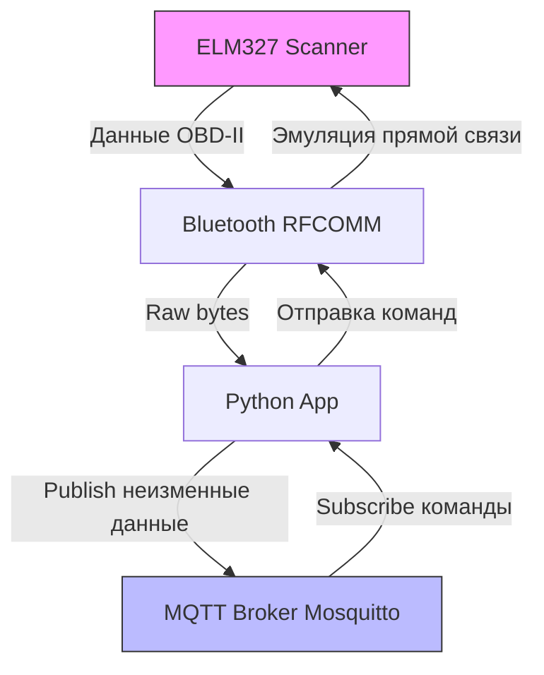

# Техническая и архитектурная документация проекта

## Обзор проекта
Проект реализует мост между Bluetooth-устройством (сканер ELM327) и MQTT-брокером для двусторонней передачи данных. Данные от ELM327 передаются в неизменном виде через MQTT. Команды от MQTT эмулируются как прямые команды к ELM327 через Bluetooth.

### Требования
- **Язык программирования**: Python
- **ОС**: Linux (Ubuntu с BlueZ stack)
- **MQTT-брокер**: Локальный Mosquitto в Docker
- **Bluetooth**: Сопряжение с ELM327 (OBD-II сканер)
- **Двусторонняя связь**: 
  - От ELM327 → Bluetooth → Python-приложение → MQTT (publish)
  - От MQTT (subscribe) → Python-приложение → Bluetooth → ELM327 (эмуляция прямой команды)

## Архитектура системы

### Компоненты
1. **Bluetooth Listener/Adapter**:
   - Использует библиотеку `bleak` (рекомендуется для async Bluetooth Low Energy на Linux) или `pybluez` для классического Bluetooth (RFCOMM, SPP для ELM327).
   - Сопряжение: Автоматическое обнаружение и pairing с ELM327 по MAC-адресу или имени устройства.
   - Чтение: Асинхронное чтение данных от ELM327 (OBD-II команды/ответы в hex/ASCII).
   - Запись: Отправка команд к ELM327 как байты, эмулируя прямую связь (без модификаций протокола).

2. **MQTT Client**:
   - Библиотека `paho-mqtt`.
   - Подключение к локальному Mosquitto (broker: localhost:1883, без аутентификации для dev).
   - Topics:
     - `elm327/data` (publish: сырые данные от ELM327).
     - `elm327/command` (subscribe: команды для отправки к ELM327).

3. **Core Application**:
   - Python-скрипт (main.py), использующий asyncio для параллельной работы Bluetooth и MQTT.
   - Поток данных:
     - Входящий: Bluetooth → буфер → publish в MQTT (неизменные байты, возможно base64-encoded для topic).
     - Исходящий: Subscribe MQTT → парсинг команды → отправка по Bluetooth.
   - Обработка ошибок: Reconnect для Bluetooth/MQTT, логирование.

4. **MQTT Broker**:
   - Docker-контейнер с Mosquitto.
   - Конфигурация: allow_anonymous true (для dev), persistent sessions.

### Потоки данных
- **ELM327 → MQTT**:
  1. ELM327 отправляет данные по Bluetooth (RFCOMM socket).
  2. Python читает байты асинхронно.
  3. Данные публикуются в topic `elm327/data` без изменений (raw bytes как string или base64).

- **MQTT → ELM327**:
  1. Сообщение приходит в topic `elm327/command`.
  2. Python декодирует (если base64) и отправляет байты по Bluetooth.
  3. ELM327 получает как прямую команду (прозрачная эмуляция).

### Диаграмма архитектуры


### Зависимости и установка

#### Системные зависимости (Linux/Ubuntu)
- Установка BlueZ для Bluetooth:
  ```
  sudo apt update
  sudo apt install bluez libbluetooth-dev
  ```
- Включение Bluetooth-сервиса:
  ```
  sudo systemctl start bluetooth
  sudo systemctl enable bluetooth
  ```

#### Python-зависимости
- Создать virtualenv:
  ```
  python -m venv venv
  source venv/bin/activate
  ```
- Установка библиотек:
  ```
  pip install paho-mqtt
  pip install pybluez  # Для классического Bluetooth (рекомендуется для ELM327 SPP)
  # Альтернатива: pip install bleak  # Для BLE, если устройство поддерживает
  pip install asyncio  # Обычно встроено в Python 3.7+
  ```

#### MQTT Broker (Mosquitto в Docker)
- Запуск контейнера:
  ```
  docker run -d --name mosquitto -p 1883:1883 -v mosquitto_config:/mosquitto/config eclipse-mosquitto
  ```
- Конфигурация (mosquitto.conf для allow_anonymous true):
  ```
  allow_anonymous true
  persistence true
  persistence_location /mosquitto/data/
  ```
- Монтирование: `-v $(pwd)/mosquitto_config:/mosquitto/config`

### Протоколы передачи

#### Bluetooth (ELM327)
- Протокол: Bluetooth Classic (RFCOMM/SPP) для большинства ELM327-адаптеров.
- Сопряжение: Использовать `bluetoothctl` для pairing:
  ```
  bluetoothctl
  scan on
  pair XX:XX:XX:XX:XX:XX  # MAC ELM327
  trust XX:XX:XX:XX:XX:XX
  connect XX:XX:XX:XX:XX:XX
  ```
- Соединение в Python (pybluez):
  - `socket` для RFCOMM: `bluetooth.BluetoothSocket(bluetooth.RFCOMM)`
  - Connect: `sock.connect((addr, 1))` (channel 1 для SPP)
- Чтение/Запись: Raw bytes, ELM327 использует ASCII-команды (e.g., "0100\r") и hex-ответы.
- Неизменная передача: Читать байты без парсинга, отправлять как есть.

#### MQTT
- Формат сообщений: Raw bytes от ELM327 → base64-encode для topic (MQTT topics - strings).
- Topics:
  - Publish: `elm327/outgoing/data` (payload: base64(b'raw_data'))
  - Subscribe: `elm327/incoming/command` (payload: base64(b'command'))
- Качество сервиса (QoS): 1 для надежной доставки.
- Эмуляция: При получении команды из MQTT, decode base64 и write bytes по Bluetooth - ELM327 видит как прямой ввод.

#### Общие соображения
- Буферизация: Обрабатывать partial reads (ELM327 может слать данные по частям).
- Таймауты: 5-10s для Bluetooth reconnect.
- Логирование: Использовать logging для отладки потоков.

## Шаги развертывания
1. Установить системные зависимости (BlueZ).
2. Настроить и запустить Mosquitto в Docker.
3. Создать Python virtualenv и установить библиотеки.
4. Сопрячься с ELM327 через bluetoothctl.
5. Запустить main.py: `python main.py`.
6. Тестировать: Отправить команду в MQTT topic и проверить ответ от ELM327.

### Тестирование и примеры кода

#### Примеры кода
Основной скрипт `main.py` использует asyncio для параллельной работы. Вот ключевые фрагменты:

1. **Импорты и настройка**:
   ```python
   import asyncio
   import bluetooth
   import base64
   import logging
   from paho.mqtt import client as mqtt

   logging.basicConfig(level=logging.INFO)
   logger = logging.getLogger(__name__)

   # Конфигурация
   ELM327_ADDR = "XX:XX:XX:XX:XX:XX"  # MAC-адрес ELM327
   MQTT_BROKER = "localhost"
   MQTT_PORT = 1883
   DATA_TOPIC = "elm327/outgoing/data"
   CMD_TOPIC = "elm327/incoming/command"
   ```

2. **Bluetooth соединение (pybluez)**:
   ```python
   async def connect_bluetooth(addr):
       sock = bluetooth.BluetoothSocket(bluetooth.RFCOMM)
       sock.connect((addr, 1))  # Channel 1 для SPP
       logger.info(f"Подключено к {addr}")
       return sock

   async def read_from_bluetooth(sock):
       while True:
           data = await asyncio.to_thread(sock.recv, 1024)
           if data:
               encoded = base64.b64encode(data).decode('utf-8')
               # Publish to MQTT
               await publish_mqtt(encoded)
           else:
               break

   async def write_to_bluetooth(sock, command):
       sock.send(command.encode('ascii') + b'\r')
   ```

3. **MQTT клиент**:
   ```python
   mqtt_client = mqtt.Client()
   mqtt_client.connect(MQTT_BROKER, MQTT_PORT, 60)
   mqtt_client.loop_start()

   def on_message(client, userdata, msg):
       if msg.topic == CMD_TOPIC:
           decoded = base64.b64decode(msg.payload.decode('utf-8'))
           asyncio.create_task(write_to_bluetooth(sock, decoded))

   mqtt_client.on_message = on_message
   mqtt_client.subscribe(CMD_TOPIC)

   async def publish_mqtt(data):
       mqtt_client.publish(DATA_TOPIC, data, qos=1)
   ```

4. **Основной цикл**:
   ```python
   async def main():
       sock = await connect_bluetooth(ELM327_ADDR)
       mqtt_client.subscribe(CMD_TOPIC)
       asyncio.create_task(read_from_bluetooth(sock))
       while True:
           await asyncio.sleep(1)  # Keep alive

   if __name__ == "__main__":
       asyncio.run(main())
   ```

#### Тестирование
- **Unit-тесты** (используя pytest и mock):
  - Моки для Bluetooth socket и MQTT client.
  - Тест: `test_bluetooth_read` - проверить чтение и base64-encode.
  - Тест: `test_mqtt_command` - проверить decode и отправку.
  - Установка: `pip install pytest pytest-mock`

  Пример теста:
  ```python
  import pytest
  from unittest.mock import Mock

  def test_read_from_bluetooth():
      mock_sock = Mock()
      mock_sock.recv.return_value = b"0100>41 00 BE 7F"
      # Simulate read and publish
      assert encoded_data == "MDEwMD5BMSAwMEJFN0Y="
  ```

- **Интеграционные тесты**:
  - Запустить Mosquitto в Docker.
  - Использовать тестовый ELM327 эмулятор (или реальное устройство).
  - Отправить тестовую команду "ATZ\r" через MQTT и проверить reset-ответ.
  - Проверить двустороннюю связь: Читать PID (e.g., "010C\r" для RPM) и publish.

- **Инструменты для тестирования**:
  - MQTT: `mosquitto_pub -t elm327/incoming/command -m '$(echo -n "0100" | base64)'`
  - Bluetooth: `hcitool` для сканирования, `rfcomm` для bind.
  - Логи: Проверить на reconnect и ошибки.

- **Возможные проблемы**:
  - Bluetooth pairing: Убедиться в trust.
  - Partial data: Буферизовать reads до полного ответа (ELM327 заканчивает '>' или CR).
  - Docker networking: Убедиться, что Python контейнер (если используется) видит localhost:1883.