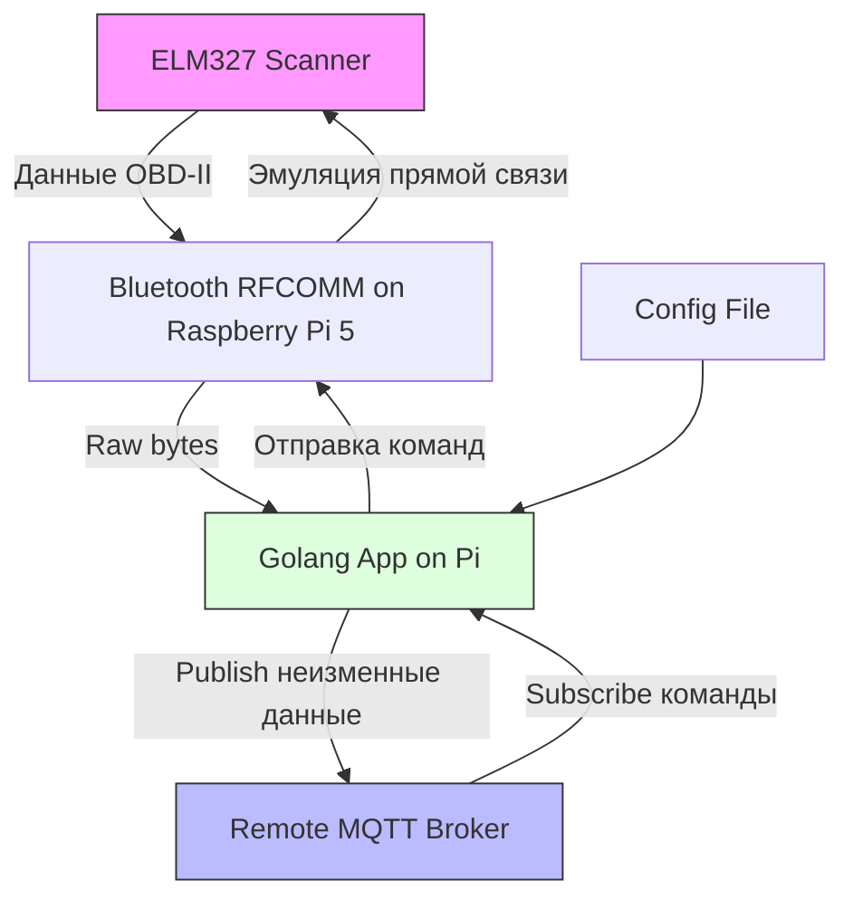

# Техническая и архитектурная документация проекта (Raspberry Pi версия)

## Обзор проекта
Проект реализует мост между Bluetooth-устройством (сканер ELM327) и удаленным MQTT-брокером для двусторонней передачи данных. Данные от ELM327 передаются в неизменном виде через MQTT. Команды от MQTT эмулируются как прямые команды к ELM327 через Bluetooth. В этой версии приложение написано на Golang, компилируется в бинарный файл и развертывается на Raspberry Pi 5. Приложение слушает Bluetooth-соединение с ELM327 напрямую на Pi, конфигурируется через файл и подключается к удаленному MQTT-серверу.

### Требования
- **Язык программирования**: Go (Golang)
- **ОС**: Raspberry Pi OS (на базе Linux с BlueZ stack) на Raspberry Pi 5
- **MQTT-брокер**: Удаленный MQTT-сервер (например, Mosquitto или другой, указанный в конфиге)
- **Bluetooth**: Сопряжение с ELM327 (OBD-II сканер) на Raspberry Pi 5
- **Двусторонняя связь**: 
  - От ELM327 → Bluetooth → Golang-приложение → MQTT (publish)
  - От MQTT (subscribe) → Golang-приложение → Bluetooth → ELM327 (эмуляция прямой команды)
- **Конфигурация**: Через YAML/JSON файл (например, config.yaml) для MAC-адреса ELM327, MQTT-брокера, портов и топиков

## Архитектура системы

### Компоненты
1. **Bluetooth Listener/Adapter**:
   - Использует стандартную библиотеку Go `net` для Bluetooth (RFCOMM/SPP) или внешнюю библиотеку вроде `github.com/muka/go-bluetooth` для более удобной работы с BlueZ.
   - Сопряжение: Автоматическое обнаружение и pairing с ELM327 по MAC-адресу из конфига.
   - Чтение: Асинхронное чтение данных от ELM327 (OBD-II команды/ответы в hex/ASCII) с использованием goroutines.
   - Запись: Отправка команд к ELM327 как байты, эмулируя прямую связь (без модификаций протокола).

2. **MQTT Client**:
   - Библиотека `github.com/eclipse/paho.mqtt.golang`.
   - Подключение к удаленному MQTT-брокеру (адрес, порт, аутентификация из конфига).
   - Topics:
     - `elm327/data` (publish: сырые данные от ELM327).
     - `elm327/command` (subscribe: команды для отправки к ELM327).

3. **Core Application**:
   - Golang-приложение (main.go), использующее goroutines и channels для параллельной работы Bluetooth и MQTT.
   - Поток данных:
     - Входящий: Bluetooth → буфер → publish в MQTT (неизменные байты, base64-encoded для топика).
     - Исходящий: Subscribe MQTT → парсинг команды → отправка по Bluetooth.
   - Обработка ошибок: Reconnect для Bluetooth/MQTT, логирование с использованием `log` или `zap`.
   - Конфигурация: Загрузка из файла (например, с помощью `github.com/spf13/viper`).

4. **Конфигурационный файл**:
   - YAML/JSON файл (config.yaml) с параметрами: ELM327 MAC, MQTT broker URL, topics, логирование уровень.

### Потоки данных
- **ELM327 → MQTT**:
  1. ELM327 отправляет данные по Bluetooth (RFCOMM socket).
  2. Golang читает байты асинхронно в goroutine.
  3. Данные публикуются в topic `elm327/data` без изменений (raw bytes как base64-string).

- **MQTT → ELM327**:
  1. Сообщение приходит в topic `elm327/command`.
  2. Golang декодирует base64 и отправляет байты по Bluetooth.
  3. ELM327 получает как прямую команду (прозрачная эмуляция).

### Диаграмма архитектуры


### Зависимости и установка

#### Системные зависимости (Raspberry Pi OS)
- Установка Go:
  ```
  sudo apt update
  wget https://go.dev/dl/go1.21.5.linux-arm64.tar.gz
  sudo tar -C /usr/local -xzf go1.21.5.linux-arm64.tar.gz
  export PATH=$PATH:/usr/local/go/bin
  ```
- Установка BlueZ для Bluetooth:
  ```
  sudo apt install bluez libbluetooth-dev
  ```
- Включение Bluetooth-сервиса:
  ```
  sudo systemctl start bluetooth
  sudo systemctl enable bluetooth
  ```

#### Go-зависимости
- Инициализация модуля:
  ```
  go mod init elm327-bridge
  go get github.com/eclipse/paho.mqtt.golang
  go get github.com/spf13/viper
  go get github.com/muka/go-bluetooth  # Опционально для Bluetooth
  ```

#### Компиляция и запуск
- Компиляция бинарника:
  ```
  GOOS=linux GOARCH=arm64 go build -o elm327-bridge main.go
  ```
- Запуск:
  ```
  sudo ./elm327-bridge
  ```
- Конфиг файл (config.yaml пример):
  ```
  elm327:
    mac: "XX:XX:XX:XX:XX:XX"
  mqtt:
    broker: "mqtt.example.com:1883"
    username: "user"
    password: "pass"
    data_topic: "elm327/data"
    command_topic: "elm327/command"
  logging:
    level: "info"
  ```

### Протоколы передачи

#### Bluetooth (ELM327)
- Протокол: Bluetooth Classic (RFCOMM/SPP) для большинства ELM327-адаптеров.
- Сопряжение: Использовать `bluetoothctl` для pairing на Pi:
  ```
  bluetoothctl
  scan on
  pair XX:XX:XX:XX:XX:XX  # MAC ELM327
  trust XX:XX:XX:XX:XX:XX
  connect XX:XX:XX:XX:XX:XX
  ```
- Соединение в Go:
  - Использовать `net.Dial("tcp", addr+":"+port)` или BlueZ API.
  - Channel 1 для SPP.
- Чтение/Запись: Raw bytes, ELM327 использует ASCII-команды (e.g., "0100\r") и hex-ответы.
- Неизменная передача: Читать байты без парсинга, отправлять как есть.

#### MQTT
- Формат сообщений: Raw bytes от ELM327 → base64-encode для топика (MQTT топики - strings).
- Topics:
  - Publish: `elm327/data` (payload: base64(raw_data))
  - Subscribe: `elm327/command` (payload: base64(command))
- Качество сервиса (QoS): 1 для надежной доставки.
- Эмуляция: При получении команды из MQTT, decode base64 и write bytes по Bluetooth - ELM327 видит как прямой ввод.

#### Общие соображения
- Буферизация: Обрабатывать partial reads (ELM327 может слать данные по частям) с использованием channels.
- Таймауты: 5-10s для Bluetooth reconnect.
- Логирование: Стандартное `log` или structured logging.

## Шаги развертывания
1. Установить системные зависимости (Go, BlueZ) на Raspberry Pi 5.
2. Создать конфигурационный файл config.yaml с параметрами MQTT и ELM327.
3. Инициализировать Go модуль и установить зависимости.
4. Сопрячься с ELM327 через bluetoothctl.
5. Скомпилировать бинарник: `go build -o elm327-bridge main.go`.
6. Запустить: `sudo ./elm327-bridge`.
7. Тестировать: Отправить команду в MQTT topic и проверить ответ от ELM327.

### Тестирование и примеры кода

#### Примеры кода
Основной файл `main.go` использует goroutines для параллельной работы. Вот ключевые фрагменты:

1. **Импорты и настройка**:
   ```go
   package main

   import (
       "encoding/base64"
       "log"
       "time"

       "github.com/eclipse/paho.mqtt.golang"
       "github.com/spf13/viper"
       "net"
   )

   var logger = log.New(log.Writer(), "", log.LstdFlags)

   // Конфигурация (загрузка из YAML)
   func loadConfig() {
       viper.SetConfigName("config")
       viper.SetConfigType("yaml")
       viper.AddConfigPath(".")
       viper.ReadInConfig()
       // ELM327_ADDR = viper.GetString("elm327.mac")
       // MQTT_BROKER = viper.GetString("mqtt.broker")
   }
   ```

2. **Bluetooth соединение**:
   ```go
   func connectBluetooth(addr string) net.Conn {
       conn, err := net.Dial("tcp", addr+":1")  // RFCOMM channel 1
       if err != nil {
           logger.Printf("Bluetooth connect error: %v", err)
           return nil
       }
       logger.Printf("Connected to %s", addr)
       return conn
   }

   func readFromBluetooth(conn net.Conn, mqttPublish func(string)) {
       buf := make([]byte, 1024)
       for {
           n, err := conn.Read(buf)
           if err != nil {
               logger.Printf("Bluetooth read error: %v", err)
               time.Sleep(5 * time.Second)
               // Reconnect logic
               continue
           }
           data := buf[:n]
           encoded := base64.StdEncoding.EncodeToString(data)
           mqttPublish(encoded)
       }
   }

   func writeToBluetooth(conn net.Conn, command string) {
       _, err := conn.Write([]byte(command + "\r"))
       if err != nil {
           logger.Printf("Bluetooth write error: %v", err)
       }
   }
   ```

3. **MQTT клиент**:
   ```go
   func connectMQTT() mqtt.Client {
       opts := mqtt.NewClientOptions()
       opts.AddBroker("tcp://" + viper.GetString("mqtt.broker"))
       // opts.SetUsernamePassword если нужно
       client := mqtt.NewClient(opts)
       token := client.Connect()
       token.Wait()
       logger.Println("Connected to MQTT")

       dataTopic := viper.GetString("mqtt.data_topic")
       cmdTopic := viper.GetString("mqtt.command_topic")

       client.Subscribe(cmdTopic, 1, func(client mqtt.Client, msg mqtt.Message) {
           payload := msg.Payload()
           decoded, _ := base64.StdEncoding.DecodeString(string(payload))
           // writeToBluetooth(decoded)
       })

       return client
   }

   func publishMQTT(client mqtt.Client, data string) {
       topic := viper.GetString("mqtt.data_topic")
       token := client.Publish(topic, 1, false, data)
       token.Wait()
   }
   ```

4. **Основной цикл**:
   ```go
   func main() {
       loadConfig()
       addr := viper.GetString("elm327.mac")
       conn := connectBluetooth(addr)
       client := connectMQTT()

       go readFromBluetooth(conn, func(encoded string) {
           publishMQTT(client, encoded)
       })

       select {}  // Keep alive
   }
   ```

#### Тестирование
- **Unit-тесты** (используя Go testing и testify/mock):
  - Тесты для Bluetooth read/write и MQTT publish/subscribe.
  - Установка: `go get github.com/stretchr/testify`
  - Пример: `go test ./...`

  Пример теста:
  ```go
  func TestReadFromBluetooth(t *testing.T) {
      // Mock conn
      // Assert base64 encode
  }
  ```

- **Интеграционные тесты**:
  - Подключиться к удаленному MQTT.
  - Использовать тестовый ELM327 эмулятор или реальное устройство на Pi.
  - Отправить команду "ATZ" через MQTT и проверить reset-ответ.
  - Проверить двустороннюю связь: Читать PID (e.g., "010C" для RPM) и publish.

- **Инструменты для тестирования**:
  - MQTT: `mosquitto_pub -h mqtt.example.com -t elm327/command -m '$(echo -n "0100" | base64)'`
  - Bluetooth: `bluetoothctl` для сканирования на Pi.
  - Логи: Проверить на reconnect и ошибки.

- **Возможные проблемы**:
  - Bluetooth pairing: Убедиться в trust на Pi.
  - Partial data: Буферизовать reads до полного ответа (ELM327 заканчивает '>' или CR).
  - Сеть: Убедиться в доступности удаленного MQTT с Pi (firewall, NAT).